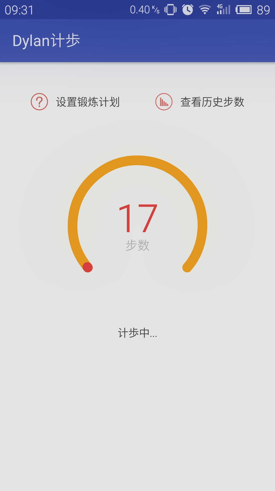
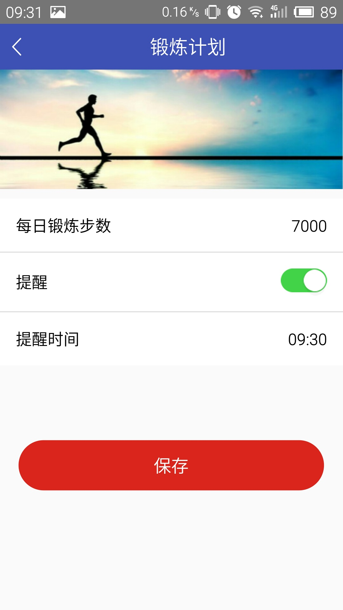

# Android精准计步开发
 亲测在小米.魅族.华为上可用
 <div  align="center">    



</div>

#### 下载体验


# 万分感谢项目中使用两位大神的算法

 * [xbase](http://www.jianshu.com/p/5d57f7fd84fa)

 * [finnfu](https://github.com/finnfu/stepcount/tree/master/demo%E4%BB%A5%E5%8F%8A%E7%AE%97%E6%B3%95%E6%96%87%E6%A1%A3)

# 1.需要在AndroidManifest.xml中添加权限

```xml
    <!--计歩需要的权限-->
    <uses-permission android:name="android.permission.VIBRATE" />
    <uses-permission android:name="android.permission.WRITE_SETTINGS" />
    <uses-feature android:name="android.hardware.sensor.accelerometer" />
    <uses-permission android:name="android.permission.RECEIVE_BOOT_COMPLETED" />
    <uses-permission android:name="android.permission.MOUNT_UNMOUNT_FILESYSTEMS" />
    <uses-feature
        android:name="android.hardware.sensor.stepcounter"
        android:required="true" />
    <uses-feature
        android:name="android.hardware.sensor.stepdetector"
        android:required="true" />

```
# 2.检测手机是否支持计歩

```java
 /**
     * 判断该设备是否支持计歩
     *
     * @param context
     * @return
     */
    @TargetApi(Build.VERSION_CODES.KITKAT)
    public static boolean isSupportStepCountSensor(Context context) {
        // 获取传感器管理器的实例
        SensorManager sensorManager = (SensorManager) context
                .getSystemService(context.SENSOR_SERVICE);
        Sensor countSensor = sensorManager.getDefaultSensor(Sensor.TYPE_STEP_COUNTER);
        Sensor detectorSensor = sensorManager.getDefaultSensor(Sensor.TYPE_STEP_DETECTOR);
        return countSensor != null || detectorSensor != null;
    }
```

# 3.功能使用

```java
   
    private boolean isBind = false;
    private Messenger mGetReplyMessenger = new Messenger(new Handler(this));
    private Messenger messenger;

    /**
     * 开启计步服务
     */
    private void setupService() {
        Intent intent = new Intent(this, StepService.class);
        isBind = bindService(intent, conn, Context.BIND_AUTO_CREATE);
        startService(intent);


    }
    /**
     * 从service服务中拿到步数
     *
     * @param msg
     * @return
     */
    @Override
    public boolean handleMessage(Message msg) {
        switch (msg.what) {
            case Constant.MSG_FROM_SERVER:
                cc.setCurrentCount(10000, msg.getData().getInt("step"));
                break;
        }
        return false;
    }


    /**
     * 用于查询应用服务（application Service）的状态的一种interface，
     * 更详细的信息可以参考Service 和 context.bindService()中的描述，
     * 和许多来自系统的回调方式一样，ServiceConnection的方法都是进程的主线程中调用的。
     */
    ServiceConnection conn = new ServiceConnection() {
        /**
         * 在建立起于Service的连接时会调用该方法，目前Android是通过IBind机制实现与服务的连接。
         * @param name 实际所连接到的Service组件名称
         * @param service 服务的通信信道的IBind，可以通过Service访问对应服务
         */
        @Override
        public void onServiceConnected(ComponentName name, IBinder service) {
            try {
                messenger = new Messenger(service);
                Message msg = Message.obtain(null, Constant.MSG_FROM_CLIENT);
                msg.replyTo = mGetReplyMessenger;
                messenger.send(msg);
            } catch (RemoteException e) {
                e.printStackTrace();
            }
        }

        /**
         * 当与Service之间的连接丢失的时候会调用该方法，
         * 这种情况经常发生在Service所在的进程崩溃或者被Kill的时候调用，
         * 此方法不会移除与Service的连接，当服务重新启动的时候仍然会调用 onServiceConnected()。
         * @param name 丢失连接的组件名称
         */
        @Override
        public void onServiceDisconnected(ComponentName name) {

        }
    };

```

